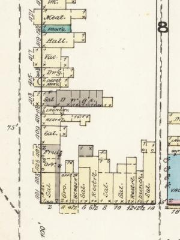

# Territory of New Mexico v Yee Shun

A major case in New Mexico History is the case of Territory of New Mexico v Yee Shun. This case resulted in Non- Christian Chinse Immigrants gaining the right to testify in court. I chose this case as it came at a time where many Chinese immigrants were under immense scrutiny after being employed by major railway companies in New Mexico. Chinese Immigrants in late 1800’s Las Vegas NM were mostly employed by railroads or owned businesses such as restaurants and laundries. The results of the Territory of New Mexico v Yee Shun case helped other states adopt these new and inclusive laws. 

 
## Why is the case of Territory of New Mexico v Yee Shun Important?

The case of Territory of New Mexico v Yee Shun became newsworthy in Las Vegas, NM, because it first started with a murder. In October of 1882, Wong Yak Chung was murdered in the China Town District. Yee Shun was tried and convicted for this murder but claimed innocence the entire time. John Wunder mentions in his essay "Territory of New Mexico v. Yee Shun: A Turning Point in Chinese Legal Relationships in the Trans-Mississippi West." That only Colorado, Iowa, Nebraska, Nevada, Oregon, and Texas had protected the Chinese right to take an oath before a court. It is only after this case did other states follow and allow Chinese Immigrants to testify in court.  

A man named Jo Chinaman who worked in a local Chinese owned laundry witnessed the murder and was asked to testify against Yee Shun. He was one of six witnesses and was heavily questioned about his religion and how to know if he was able to swear under oath if he was not part of Christianity.  

Quote from the court case explaining how they justified using Jo Chinaman as a witness even when he is not a follower of Christianity. Gildersleeve Charles H.; et al. Reports of Determined in the Supreme Court of the Territory of New Mexico. Chicago, Callaghan & Co.

## How does this relate to AAPI History?

The perception of Asian Americans in New Mexico wasn't a positive one. In a newspaper article from the Las Vegas Daily Gazette, written in 1882, gave the New Mexican view on Chinese immigrants. The paper explained how most immigrants coming to the United States were “unfortunate, dissatisfied or criminal Chinamen that they can persuade to leave their native country” and that once they were working under U.S companies they were “reduced to a condition similar to that of a former Russian serf”. (Las Vegas Daily Gazette,1882). The newspaper article wanted to dehumanize them by comparing them to common criminals or an unfree person.  

Along with the negative ideas about the newcomers the paper also mentions that “for American laws they have the greatest contempt imaginable.” (Las Vegas Daily Gazette,1882). This newspaper was written for Las Vegas locals and was feeding them biased opinions on the immigrant community that could lead to more prejudice against the Asian American community. 

The location of the murder. John Lee’s Laundry is located at 411½ Grand Avenue, Las Vegas, NM Sanborn Fire Insurance Map from Las Vegas, San Miguel County, New Mexico. Sanborn Map Company, Oct, 1883. Map. Retrieved from the Library of Congress, www.loc.gov/item/sanborn05698_001/  

## How does this case relate to New Mexico History? 

Las Vegas New Mexico was a small city in New Mexico compared to cities like the state capitol and Albuquerque. Even with having a smaller population they had a larger Chinese immigrant community a “Chinatown” neighborhood lived in by railroad workers and business owners. These professions stretched through many NM towns such as Silver City, Raton, and Albuquerque.  

## Conclusion 

After doing my project on the Yee Shun case it helped ne learn more about the small Asian American communities in the early stages of Chinese migration and how they were affected by prejudice. This event was historically significant as it pushed other states and territories to push past the swearing oaths under different religions in court preceding's. It also gave Chinese Americans a footing in gaining somewhat equal treatment the legal system. 